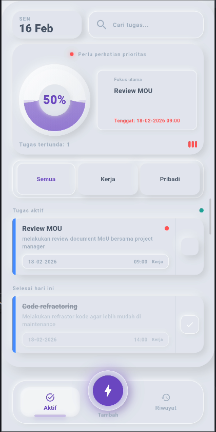
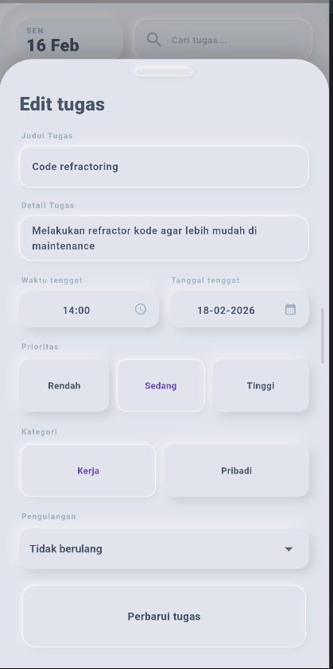
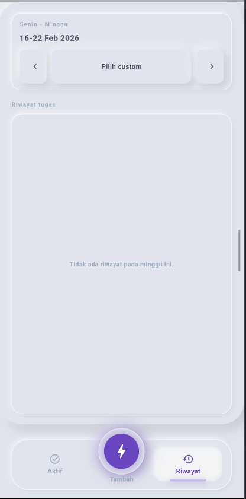

# Oi!Kerjain

Oi!Kerjain adalah aplikasi task scheduler harian untuk membantu kamu tetap terorganisir, fokus, dan konsisten menyelesaikan tugas.

README ini ditujukan untuk pengguna akhir dan menampilkan galeri aplikasi.  
Dokumentasi teknis developer ada di `oikerjain/README.md`.

## Kenapa Oi!Kerjain?

- Tampilan bersih dengan gaya neuromorphic.
- Workflow cepat: tambah tugas dalam beberapa tap.
- Progress harian jelas (termasuk tugas yang selesai hari ini).
- Riwayat rapi dengan filter minggu dan rentang tanggal custom.
- Notifikasi lokal dengan aksi cepat (`DONE`, `SNOOZE 10M`).

## Galeri Aplikasi

### Beranda Tugas Aktif



### Tambah / Edit Tugas



### Riwayat + Filter Mingguan



## Fitur Pengguna

- Kelola tugas: tambah, ubah, hapus, tandai selesai.
- Kategori tugas: `Kerja` dan `Pribadi`.
- Prioritas: `Rendah`, `Sedang`, `Tinggi`.
- Pengulangan tugas: tidak berulang, harian, mingguan.
- Filter & pencarian tugas aktif.
- Riwayat 14 hari dengan filter mingguan dan custom date range.

## Cara Mencoba Cepat

```bash
cd oikerjain
flutter pub get
flutter run
```

## Cara Mencoba via GitHub Release (Tanpa Setup Flutter)

Kamu juga bisa mencoba aplikasi langsung dari file rilis (tanpa install Flutter):

1. Buka halaman release resmi:  
   `https://github.com/Dimas0824/Oi-Kerjain/releases`
2. Pilih release terbaru (paling atas).
3. Download file pada bagian **Assets** sesuai perangkat kamu.
4. Install/jalankan file:
   - Android: install file `.apk`

### Panduan Memilih APK Android

Jika kamu **tidak yakin ABI/arsitektur device**, download versi universal:

- `OiKerjain-v1.0.1.apk` (Recommended)

Jika kamu tahu ABI device kamu, pilih APK spesifik berikut:

- `OiKerjain-v1.0.1-arm64-v8a.apk`  
  untuk hampir semua HP Android modern (64-bit ARM).
- `OiKerjain-v1.0.1-armeabi-v7a.apk`  
  untuk HP Android lama (32-bit ARM).
- `OiKerjain-v1.0.1-x86_64.apk`  
  untuk emulator Android/Chromebook/perangkat x86_64.

Catatan:

- Build split-per-ABI menghasilkan file setara:
  - `app-arm64-v8a-release.apk`
  - `app-armeabi-v7a-release.apk`
  - `app-x86_64-release.apk`
- Kalau salah pilih ABI, aplikasi biasanya gagal terpasang.  
  Solusi paling aman: pakai `OiKerjain-v1.0.1.apk` (universal).
- Jika SmartScreen/antivirus memberi peringatan, pastikan file diunduh dari halaman release resmi di atas.

### Jika Belum Ada Asset Release

Jika di release terbaru belum tersedia file untuk platform kamu, jalankan project dari source menggunakan langkah di bagian **Cara Mencoba Cepat**.

## Catatan

- Semua data disimpan lokal di perangkat.
- Aplikasi ini masih dalam tahap pengembangan awal, jadi harap maklum jika ada bug atau fitur yang belum sempurna.
- Feedback sangat dihargai untuk membantu meningkatkan aplikasi ini!

Terima kasih sudah mencoba Oi!Kerjain. Semoga aplikasi ini membantu kamu tetap produktif dan terorganisir setiap hari.
